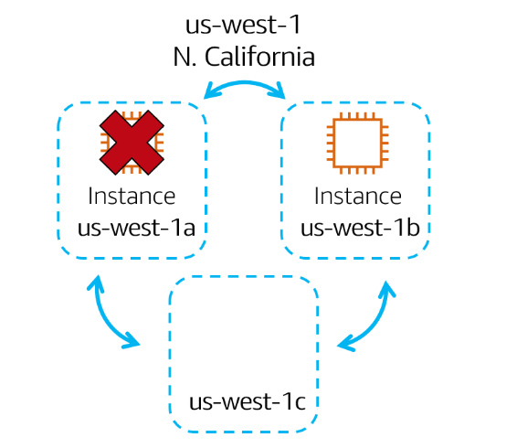

# Global Infrastructure and Reliability

## [Regions](#regions)

**A Region is a geographical area that contains AWS resources.**

Each **AWS Region** consists of multiple isolated and physically separate Availability Zones within a geographic Region.

Inside each Region, there are multiple data centers that have all the compute, storage, and other services you need to run your applications. 
 
Each Region can be connected to each other Region through a high speed fiber network.

**Regional data sovereignty** is part of the critical design of AWS Regions. Each Region is isolated from every other Region in the sense that absolutely no data goes in or out of your environment in that Region without you explicitly granting permission for that data to be moved.

### [Selecting a Region](#selecting-a-region)

Factors to be considered:
- **Compliance** with data governance and legal requirements.

*For example,* if your company requires all of its data to reside within the boundaries of the UK, you would choose the London Region. 

- Proximity to your customers.

*For example,* your company is based in Washington, DC, and many of your customers live in Singapore. You might consider running your infrastructure in the Northern Virginia Region to be close to company headquarters, and run your applications from the Singapore Region.

- Available services within a Region.

*For example,* Amazon Braket is not yet available in every AWS Region around the world, so developers would have to run it in one of the Regions that already offers it.

- Pricing.

*For example,* the way Brazil’s tax structure is set up, it might cost 50% more to run the same workload out of the São Paulo Region compared to the Oregon Region.

---

## [Availability Zones](#availability-zones)

**An Availability Zone is a single data center or a group of data centers within a Region.**

Each Availability Zone is one or more discrete data centers with redundant power, networking, and connectivity. 

Availability Zones are located tens of miles apart from each other. This is close enough to have low latency between Availability Zones. and if a disaster occurs in one part of the Region, they are distant enough to reduce the chance that multiple Availability Zones are affected.

If us-west-1a AZ were to fail, your application would still be running in us-west-1b.

---

## [Notes](#notes)

- Amazon Braket is a quantum computing platform.
- Latency is the time between when content requested and received.
- It's always recommended you deploy your infrastructure across *at least* *two* Availability Zones in a Region. 
- AWS ELB is actually a regional construct. It runs across all Availability Zones, communicating with the EC2 instances that are running in a specific Availability Zone. 

---

# References

- [AWS Global Infrastructure](https://aws.amazon.com/about-aws/global-infrastructure)
- [Regions and Availability Zones](https://aws.amazon.com/about-aws/global-infrastructure/regions_az)