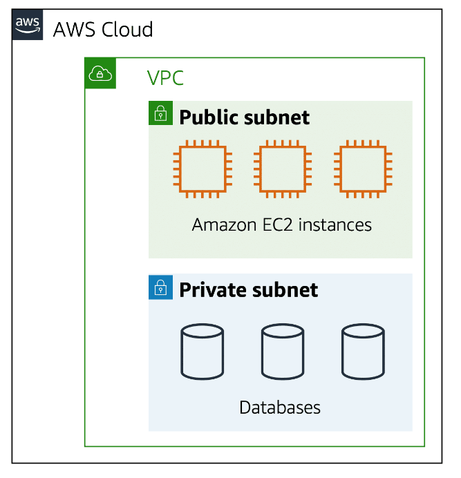
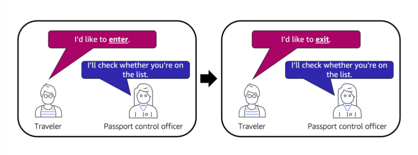
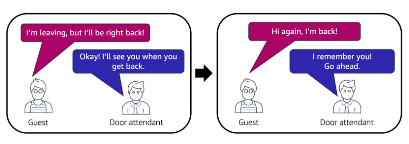
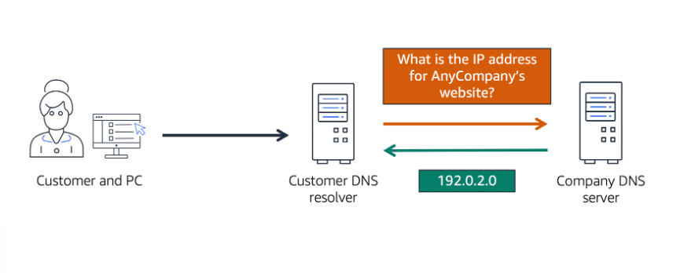
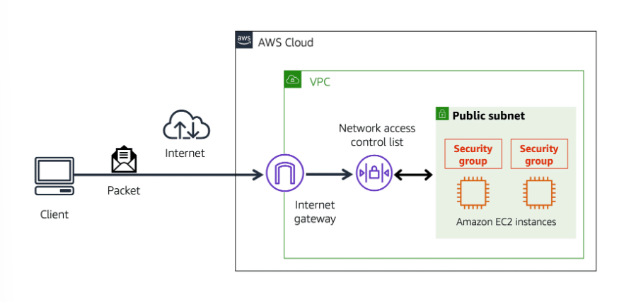

# Networking

# [Amazon VPC](#amazon-vpc)

A networking service that you can use to establish boundaries around your AWS resources is [Amazon Virtual Private Cloud (Amazon VPC)](https://aws.amazon.com/vpc/).

**Amazon VPC enables you to provision an isolated section of the AWS Cloud.** 

In this isolated section, you can launch resources in a virtual network that you define. 

Within a virtual private cloud (VPC), you can organize your resources into subnets. 

**A subnet is a section of a VPC that can contain resources such as Amazon EC2 instances.** Subnets are chunks of IP addresses in your VPC that allow you to group resources together. 

---

## [Public vs Private Facing Resources](#public-vs-private-facing-resources)

In order to allow traffic from the public internet to flow into and out of your VPC, you must attach what is called an **internet gateway**, or IGW, to your VPC. 

In some cases, we want a private gateway that only allows people in if they are coming from an approved network, not the public internet. A **virtual private gateway** allows you to create a VPN connection between a private network, like your on-premises data center or internal corporate network to your VPC. 

---

## [Internet Gateway](#internet-gateway)

**To allow public traffic from the internet to access your VPC, you attach an internet gateway to the VPC.**

An internet gateway is a connection between a VPC and the internet. Without an internet gateway, no one can access the resources within your VPC.

---

## [Virtual Private Gateway](#virtual-private-gateway)

**To access private resources in a VPC, you can use a virtual private gateway.**

A **virtual private network (VPN)** connection encrypts (or protects) your internet traffic from all the other requests around it. A virtual private gateway enables you to establish a virtual private network (VPN) connection between your VPC and a private network.

---

## [AWS Direct Connect](#aws-direct-connect)

**[AWS Direct Connect](https://aws.amazon.com/directconnect/) is a service that enables you to establish a dedicated private connection between your data center and a VPC.**

The private connection that AWS Direct Connect provides helps you to *reduce network costs* and *increase the amount of bandwidth* that can travel through your network.

---

# [Subnets](#subnets)

**A subnet is a section of a VPC in which you can group resources based on security or operational needs. Subnets can be public or private.**

**Public subnets** contain resources that need to be accessible by the public, such as an online store’s website.

**Private subnets** contain resources that should be accessible only through your private network, such as a database.

---

When a customer requests data from an application hosted in the AWS Cloud, this request is sent as a packet. **A packet is a unit of data sent over the internet or a network.** 

It enters into a VPC through an internet gateway. Before a packet can enter into a subnet or exit from a subnet, it checks for permissions. 

**The VPC component that checks packet permissions for subnets is a network access control list (ACL).**

---

# [Network Access Control Lists](#network-access-control-lists)

**A [network access control list (ACL)](https://docs.aws.amazon.com/vpc/latest/userguide/vpc-network-acls.html) is a virtual firewall that controls inbound and outbound traffic at the subnet level.**

Each AWS account includes a default network ACL.

- **By default, your account’s default network ACL allows all inbound and outbound traffic.**

- **For custom network ACLs, all inbound and outbound traffic is denied until you add rules to specify which traffic to allow.**

- **All network ACLs have an explicit deny rule.**

---

## [Stateless packet filtering](#stateless-packet-filtering)

**Network ACLs perform stateless packet filtering.**

They remember nothing and check packets that cross the subnet border each way: inbound and outbound. 

After a packet has entered a subnet, it must have its permissions evaluated for resources within the subnet, such as Amazon EC2 instances. 

**The VPC component that checks packet permissions for an Amazon EC2 instance is a security group.**

---

# [Security Groups](#security-groups)

**A [security group](https://docs.aws.amazon.com/vpc/latest/userguide/VPC_SecurityGroups.html) is a virtual firewall that controls inbound and outbound traffic for an Amazon EC2 instance.**

**By default, a security group denies all inbound traffic and allows all outbound traffic.**

---

## [Stateful packet filtering](#stateful-packet-filtering)

**Security groups perform stateful packet filtering.**

They remember previous decisions made for incoming packets.

---

# [Domain Name System (DNS)](#domain-name-system-dns)

Route 53 is AWS's domain name service. DNS translates website names into IP, or Internet Protocol addresses. 

**DNS resolution is the process of translating a domain name to an IP address.**

---

### [DNS Resolution Example](#dns-resolution-example)

- When you enter the domain name into your browser, this request is sent to a customer DNS resolver. 
- The customer DNS resolver asks the company DNS server for the IP address that corresponds to AnyCompany’s website.
- The company DNS server responds by providing the IP address for AnyCompany’s website, 192.0.2.0.

---

# [Notes](#notes)

- One VPC might have multiple types of gateways attached for multiple types of resources all residing in the same VPC, just in different subnets. 
- The virtual private gateway is the component that allows protected internet traffic to enter into the VPC.
- You work with a Direct Connect partner in your area to establish this connection, because AWS Direct Connect provides a *physical* line that connects your network to your AWS VPC.
- If you have multiple Amazon EC2 instances within a subnet, you can associate them with the same security group or use different security groups for each instance. 
- Both network ACLs and security groups enable you to configure custom rules for the traffic in your VPC. 
- **The key difference between a security group and a network ACL is the security group is stateful**, meaning, it has some kind of a memory when it comes to who to allow in or out, **and the network ACL is stateless**, which remembers nothing and checks every single packet that crosses its border regardless of any circumstances. 
- A CDN is a network that helps to deliver edge content to users based on their geographic location.
- Route 53 can direct traffic to different endpoints using several different routing policies, such as latency-based routing, geolocation DNS, geoproximity, and weighted round robin.

---

# References