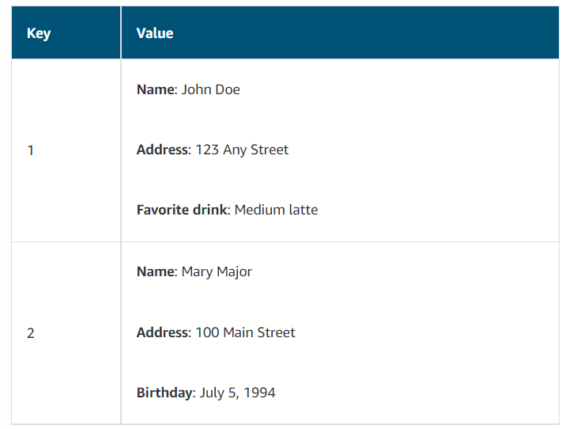

# Databases

# [Relational Databases](#relational-databases)

In a **relational database**, data is stored in a way that relates it to other pieces of data. 

Relational databases use **structured query language (SQL)** to store and query data.

Example of data in a relational database:

---

# [Amazon RDS](#amazon-rds)

**[Amazon Relational Database Service (Amazon RDS)](https://aws.amazon.com/rds/) is a service that enables you to run relational databases in the AWS Cloud.**

Amazon RDS is a managed service that automates tasks such as hardware provisioning, database setup, patching, and backups. 

Many Amazon RDS database engines offer:
-  **encryption at rest** (protecting data while it is stored) and 
- **encryption in transit** (protecting data while it is being sent and received).

---

## [Amazon RDS Database Engines](#amazon-rds-database-engines)

Amazon RDS is available on six database engines, which optimize for memory, performance, or input/output (I/O). 

1. [Amazon Aurora](#amazon-aurora)
2. PostgreSQL
3. MySQL
4. MariaDB
5. Oracle Database
6. Microsoft SQL Server

---

# [Amazon Aurora](#amazon-aurora)

**[Amazon Aurora](https://aws.amazon.com/rds/aurora/) is an enterprise-class relational database.** It is compatible with MySQL and PostgreSQL relational databases.

Consider Amazon Aurora if your workloads require high availability. It replicates **six copies of your data across three Availability Zones** and continuously backs up your data to Amazon S3.

---

# [Nonrelational Databases](#nonrelational-databases)

**Nonrelational databases are sometimes referred to as “NoSQL databases” because they use structures other than rows and columns to organize data.**

With **key-value pairs**, data is organized into items (keys), and items have attributes (values). 

---

# [Amazon DynamoDB](#amazon-dynamodb)

**[Amazon DynamoDB](https://aws.amazon.com/dynamodb/) is a key-value database service.** 

Features:
- **Serverless** 

DynamoDB is serverless which means you don't have to provision, patch or manage servers or install, maintain or operate software.

- **Automatic Scaling**

As the size of your database shrinks or grows, DynamoDB automatically scales to adjust for changes in capacity.

---

### [RDS vs DynamoDB](#rds-vs-dynamodb)

If you need complex relational joins use RDS, because it's built for business analytics. If you don't need complex joint functionality and don't want additional expense, use DynamoDB. 

Scenarios in which you should use RDS:
- Using SQL to organize data
- Storing data in an Amazon Aurora database

Scenarion in which you should use DynamoDB:
- Running a serverless database
- Storing data in a key-value database
- Scaling up to 10 trillion requests per day

---

# [Notes](#notes)

---

# References